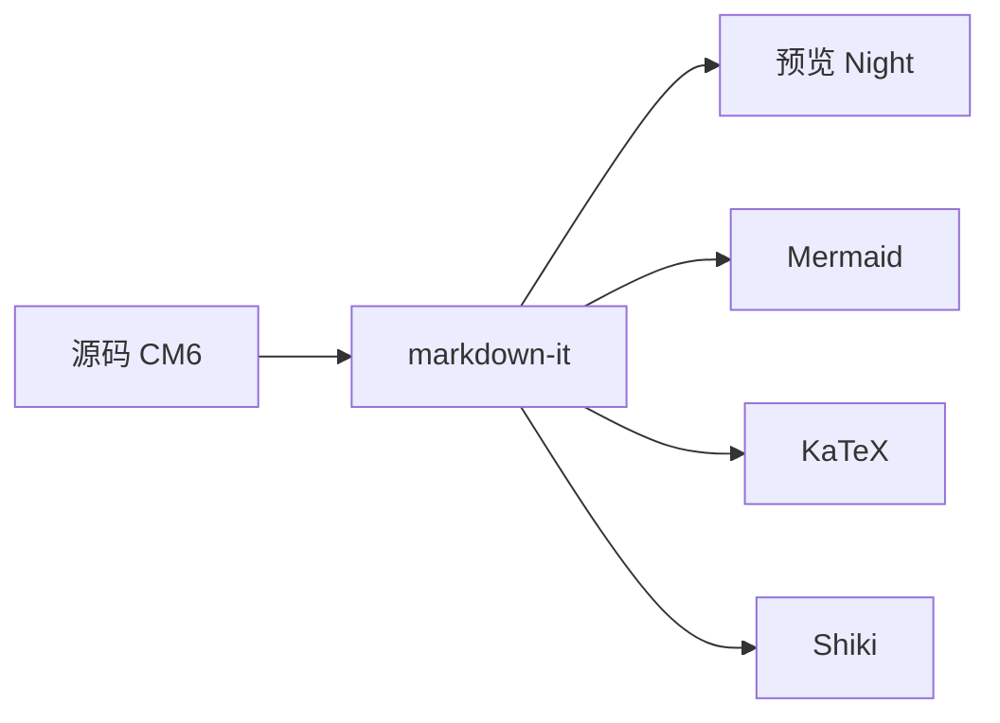

# Lunark 月刻

轻量本地 Markdown 编辑器。**一期 = 方案 B：CodeMirror6 双栏 + markdown-it**；一体化 WYSIWYG 放在二期改造。

## 快捷键

| 操作 | 快捷键 |
|---|---|
| 打开文件 | `Ctrl+O` |
| 打开文件夹 | `Ctrl+Shift+O` |
| 新建 | `Ctrl+N` |
| 保存 | `Ctrl+S` |
| 另存为 | `Ctrl+Shift+S` |
| 仅源码 / 双栏 | `Ctrl+/` |

## 图片

1. 先 **保存** 当前 `.md` 到磁盘  
2. 将图片拖入编辑区 → 自动写入同级 `./assets/` 并插入 ``  
3. 预览通过 Tauri asset 协议加载本地相对路径图片  

也可手写：``

## GFM 示例

- **粗体** *斜体* ~~删除线~~
- [x] 任务已完成
- [ ] 待办事项

> 引用块在 Night 主题下使用低对比灰色。

### 代码（Shiki）

```ts
const greeting = "hello from Lunark";
console.log(greeting);
```

行内代码：`const x = 1`

### 公式（KaTeX）

行内：$E = mc^2$

块级：

$$
\int_{-\infty}^{\infty} e^{-x^2}\,dx = \sqrt{\pi}
$$

### 图表（Mermaid）



### 表格

| 阶段 | 形态 | 状态 |
|---|---|---|
| MVP | 双栏预览 | 扩展渲染已接 |
| 二期 | WYSIWYG | 未开始 |

脚注示例[^1]。

[^1]: 二期见 `docs/PHASE2-WYSIWYG.md`。
